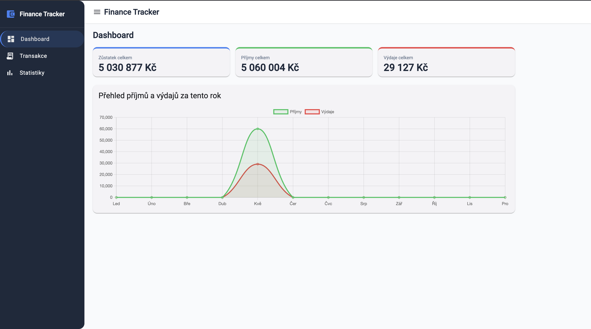
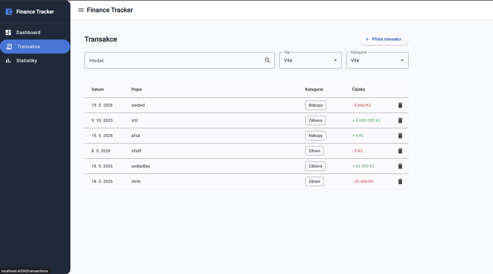
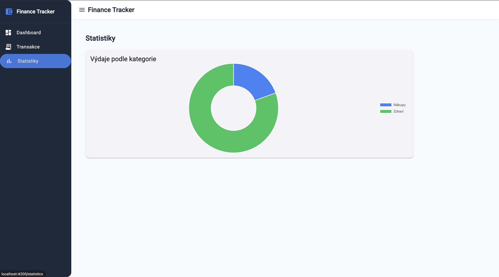

# Finance Tracker

A personal finance tracking application built with modern Angular 18 architecture.

## Features

- 📊 **Dashboard** — overview of balance, income and expenses with a monthly chart
- 💳 **Transactions** — add, delete and filter transactions by type, category and search
- 📈 **Statistics** — expense breakdown by category (doughnut chart)
- 💾 **Persistent storage** — data saved in localStorage
- 🌍 **Localization** — Czech language support via ngx-translate
- 📱 **Responsive** — mobile-friendly with collapsible sidenav

## Tech Stack

- **Angular 21** — standalone components, Signals, lazy loading
- **RxJS** — reactive filtering with BehaviorSubject and debounceTime
- **Angular Material** — UI components
- **Tailwind CSS** — utility-first styling
- **Chart.js + ng2-charts** — data visualization
- **ngx-translate** — internationalization

## Architecture Highlights

- **Signals** for state management in TransactionService
- **RxJS** for real-time filtering with debounce
- **OnPush** change detection strategy across all components
- **Feature-based** folder structure
- **Standalone components** throughout

## Getting Started

```bash
# Clone the repository
git clone https://github.com/machajdaaa/finance-tracker.git
cd finance-tracker

# Install dependencies
npm install

# Run development server
ng serve
```

Open `http://localhost:4200`

## Screenshots

### Dashboard


### Transactions


### Statistics

